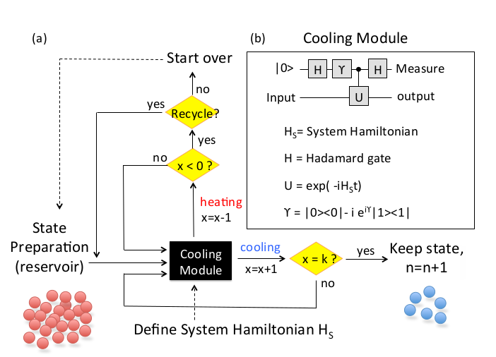

%Adiabatic Simulator

# satisfiability problem
An n-bit instance of satisfiability is a formula
$$
C_1\land C_2\land \dots \land C_M
$$

#
where each clause C a is True or False depending on the values of some subset of the bits. For a single
clause, involving only a few bits, it is easy to imagine constructing a quantum device that evolves
to a state that encodes the satisfying assignments of the clause. The real difficulty, of course, lies in
constructing a device that produces an assignment that satisfies all M clauses.

#

Many computationally interesting problems can be recast into an equivalent problem of finding a
variable assignment that minimizes an “energy” function. As a specific example, consider 3-SAT. An
n-bit instance of 3-SAT is a Boolean formula,, that is specified by a collection of Boolean clauses,
each of which involves (at most) 3 of the n bits. Each bit z i can take the value 0 or 1 and the i label
runs from 1 to n. Clause C is associated with the 3 bits labeled $i_C$ , $j_C$ , and $k_C$ . For each clause C we
define an energy function

#

$$
\begin{cases}
0,\quad  \text{if(z_{iC},z_{jC},z_{kC}) satisfies clause C}\\
1,\quad  \text{if(z_{iC},z_{jC},z_{kC}) violates clause C}
\end{cases}
$$

#

We then define the total energy h as the sum of the individual $h_C$

$$
h = \sum_{C} h_C
$$

# Adiabatic Theorem

A quantum system evolves according to the Schrödinger equation
$$
i\frac{d}{dt}|\psi(t)\rangle = H(t)|\psi(t)\rangle
$$

#

The adiabatic theorem tells us how to follow this evolution in the case 
that H(t) is slowly varying. Consider a smooth one-parameter family of Hamiltonians $\hat{H(s)}$,$0\leq s\leq 1$,and take

$$
H(t) = \hat{H(t/T)}
$$

#

define the instantaneous eigenstates and eigenvalues of $\hat{H(s)}$ by

$$
H(s)|l;s\rangle = E_{l}(s)|l;s\rangle
$$

#

with

$$
E_0(s)\leq E_1(s)\leq \dots \leq E_{N-1}(s)
$$

where N is the dimension of the Hilbert space. Suppose $|\psi(0)\rangle$ is the ground state of $\hat{H(0)}$, that is 

$$
|\psi(0)\rangle = |l=0;s=0\rangle
$$

#

according to the adiabatic theorem, if the gap between the two lowest levels, $E_1(s)-E_0(s)$, is strictly greater than zero for all $0\leq s\leq 1$,then 

$$
\lim_{T\rightarrow \infty} |\langle l=0;s=1|\psi(T)\rangle| = 1
$$

This means that the existence of a nonzero gap guarantees that $|\psi(t)\rangle$ obeying remains very close to the instantaneous ground state of $H(t)$ of the form for all t from 0 to T if is big enough. Let us define the minimum gap by

#

$$
g_{min} = \min_{0\leq s\leq 1}(E_{1}(s)-E_{0}(s))
$$

A closer look at the adiabatic theorem tells us that taking
$$
T>\frac{\epsilon}{g^2_{min}}
$$

where
$$
\epsilon = \max_{0\leq s\leq 1}|\langle l=1;s|\frac{d\hat{H}}{ds}|l=0;s\rangle |
$$

#

can make

$$
|\langle l=0;s=1|\psi(T)\rangle|
$$

arbitrarily close to 1.

# Problem Hamiltonian $H_P$

If we go from classical to quantum computation we replace the bit $z_i$ by a spin-$\frac{1}{2}$ qubit labeled by $|z_i\rangle$ where $z_i=0,1$,The states |z_i\rangle are eigenstates of the z component of the i-th spin

#

$$
|0\rangle = \begin{pmatrix}
1\\
0
\end{pmatrix}
\quad and \quad 
|1\rangle = \begin{pmatrix}
0\\
1
\end{pmatrix}
$$

#

so 

$$
H_{P,C}(|z_1\rangle |z_2\rangle\dots |z_n\rangle) = h_C(z_{iC},z_{jC},z_{kC})|z_1\rangle |z_2\rangle\dots |z_n\rangle
$$

The Hamiltonian associated with all of the clauses, which we call $H_P$

$$
H_P = \sum_{C} H_{P,C}
$$

# The Initial Hamiltonian $H_B$

For a given problem, specifying $H_P$ is straightforward but finding its ground state may be difficult. We now consider an n-bit Hamiltonian $H_B$ that is also straightforward to construct but whose ground state is simple to find. Let $H_B^{(i)}$ be the 1-bit Hamiltonian acting on the i-th bit

#

$$
H_B^{(i)} = \frac{1}{2}(1-\sigma_{x}^{(i)})\quad with\quad \sigma_x^{(i)}=\begin{pmatrix}
0 & 1\\
1 & 0
\end{pmatrix}
$$

#

so 
$$
H_{B}^{(i)} |x_i = x\rangle = x|x_i = x\rangle
$$

#

where

$$
|x_i=0\rangle = \frac{1}{\sqrt{2}}\begin{pmatrix}1\\1\end{pmatrix} and |x_i=1\rangle = \frac{1}{\sqrt{2}}\begin{pmatrix}1\\-1\end{pmatrix}
$$

#

Continuing to take 3-SAT as our working example, clause C is associated with the  bits $i_C,j_C,$ and $k_C$. Now define
$$
H_{B,C} = H_B^{(i_C)}+H_B^{(j_C)}+H_B^{(k_C)}
$$

#

and

$$
H_B = \sum_C H_{B,C}
$$

# Adiabatic Evolution
We will now use adiabatic evolution to go from the known ground state of $H_B$ to the unknown ground state of $H_P$. Assume for now that the ground state of $H_P$ is unique. Consider

#

$$
H(t) = (1-t/T)H_B + (t/T)H_P
$$

#

so from
$$
\hat{H(s)} = (1-s) H_B + s H_P
$$

#

Prepare the system so that it begins at t=0 in ground state of $H(0) = H_B$ According to the adiabatic theorem, if $g_{min}$ is not zero and the system evolves according to, then for T big enough $|\psi(T)\rangle$ will be very close to the ground state of $H_P$, that is, the solution to the computational problem.

#

Using the explicit form of and we see that $H(t)$ and $\hat{H(t)}$ are sums of individual terms associated with each clause. For each clause C let

#

$$
H_C(t) = (1-t/T)H_{B,C} + (t/T) H_{P,C}
$$

and accordingly
$$
\hat{H_C(s)} = (1-s)H_{B,C} + s H_{P,C}
$$

#

Then we have 
$$
H(t) = \sum_{C} = H_C(t)
$$

and
$$
\hat{H}(s) = \sum_C \hat{H}_C(s)
$$

This gives the explicit form of H(t) described in the Introduction as a sum of Hamiltonians associated with individual clauses.

# Cooling Based Adiabatic Computation

#
Hadamard gates:

$$
H = \frac{1}{\sqrt{2}} (|0\rangle + |1\rangle)\langle 0| +\frac{1}{\sqrt{2}} (|0\rangle - |1\rangle)\langle 1|
$$

#

applied to the ancilla qubit in the beginning and at the end of the quantum circuit.

#

local phase gate

$$
R_z(\gamma) = |0\rangle\langle 0| - i e^{i\gamma} |1\rangle\langle 1|
$$

#

where the parameter $\gamma$ plays  a role in determining the overall efficiency of the cooling performance of the algorithm.

#

two-qubit controlled unitary operation,

$$
1\otimes |0\rangle\langle 0| + U\otimes |1\rangle\langle 1|
$$

#

where 1 is the identity operator, and

$$
U(t) = e^{-i H_s t}
$$

#

is the time-evolution operator for the system. Here H_s is the Hamiltonian of the system, and the energy is defined as the quantum expectation value of $H_s$. The parameter t also determines the overall efficiency of the algorithm.

#

for any given initial state (it works equally well for mixed states), $|\psi_{in}\rangle$ and the ancilla state |0\rangle

$$
|\psi_{in}\rangle\otimes |0\rangle
$$

#

The quantum circuit then produces the following output state:

$$
\frac{1}{2}(1-i e^{i\gamma}U)|\psi_{in}\rangle |0\rangle +\frac{1}{2}(1+i e^{i\gamma} U)|\psi_{in}\rangle |1\rangle
$$

#

A measurement on the ancilla qubit in the computational basis ${|0\rangle , |1\rangle }$ yields one of the two (unnormalized) states

$$
(1\pm i e^{i\gamma} U)|\psi_{in}\rangle
$$

#

which have mean energies either higher (for outcome |1\rangle) or lower (for outcome |0\rangle) than that of the initial state $|\psi_{in}\rangle$

# structure of the simulator