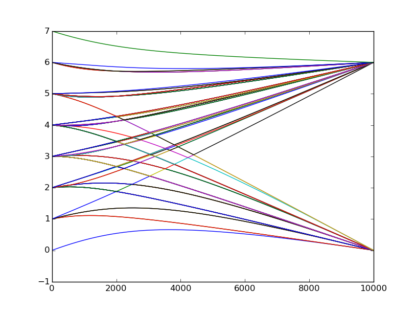

# Adiabatic Computation Simulator

This an Adiabatic Computation Simulator for quantum computation

to calculate a given instance,a truth table of the cost function is needed.

to use this package,use `Pkg.clone` to clone the repo.and
```julia
using AdiaRoll
```

the method `evolution` evolutes the Adiabatic system,and will return three variable

- eigenvalue
- final state
- success probablity

```julia
using AdiaRoll

eigen,state,p = evolution(
    1e4,
    [TruthTable(0b10010111,[1,2,3]),
    TruthTable(0b10010111,[2,3,4]),
    TruthTable(0b10010111,[3,4,5]),
    TruthTable(0b10010111,[5,6,7]),
    TruthTable(0b10010111,[1,5,6]),
    TruthTable(0b10010111,[2,3,6]),
    ],7)
```

```
TruthTable(truthvalue,bitID)
```

use `TruthTable` to construct the cost function,for example a cost function define below
$$
\begin{aligned}
&h_c(z_1,z_2,z_3) = 1\quad \text{if there is a 1 among (z_1,z_2,z_3)}\\
&h_c(z_1,z_2,z_3) = 0\quad \text{if not}
\end{aligned}
$$

then the truth table of this cost function is

bits value | truth value
-------------- | ---------------
 0     0    0 | 0
 0   0      1 | 1
 0   1      0  | 1
 0   1   1    | 0
 1   0   0    | 1
 1   0   1    | 0
 1   1   0    | 0
 1   1   1    | 0

so the truth table construct as following,the `truthvalue` contains the truth value as a number
and the `bitID` contains the ID of bits in this truth table

```julia
TruthTable(0b01101000,[1,2,3])
```

for multi-thread calculation,use the `blas_set_num_threads` method

```julia
using AdiaRoll
blas_set_num_threads(8)

eigen,state,p = evolution(
    1e4,
    [TruthTable(0b10010111,[1,2,3]),
    TruthTable(0b10010111,[2,3,4]),
    TruthTable(0b10010111,[3,4,5]),
    TruthTable(0b10010111,[5,6,7]),
    TruthTable(0b10010111,[1,5,6]),
    TruthTable(0b10010111,[2,3,6]), 
    ],7)

State2TruthTable(state,3)
@show p
```



PRs are welcome!

by [Roger Luo](rogerluo.cc)